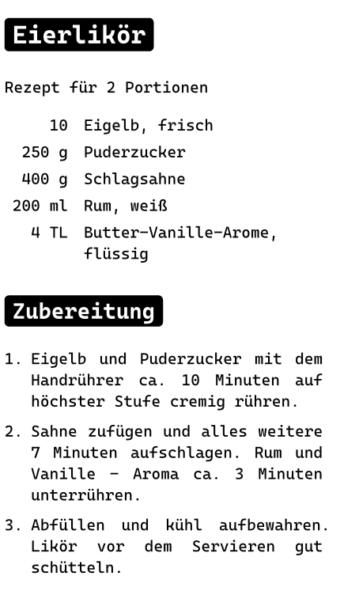

# Print recipes to a receipt printer

Call `bin/precipe` to select and print to lp -d bixolon.

Call `bin/to-md.py kässpätzle.yml | typst compile -f - example.png` to generate the following example:

